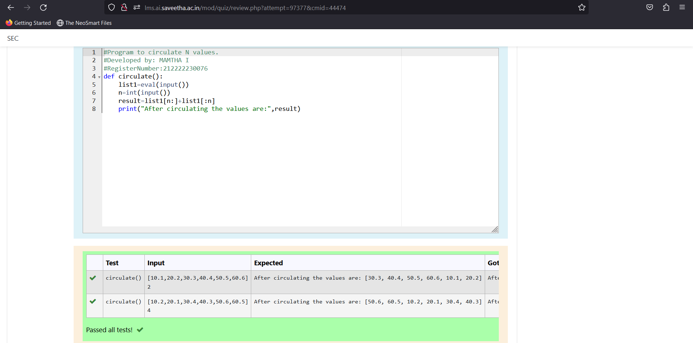

# Circulate-the-values-of-N-variables
## Aim:
To write a python program to circulate the n variables using function concept
## Equipment’s required:
PC
Anaconda - Python 3.7
## Algorithm: 

### Step 1:

Get value from the user for calculation

### Step 2:

Assign the values
### Step 3:

Get the value from the user for the number of rotation
### Step 4:

Using the slicing concept rotate the list
### Step 5:

Print both the values it would be circulated
### Step 6:

End the program

# Program:
#Program to circulate N values.

#Developed by: MAMTHA I

#RegisterNumber:212222230076

def circulate():

    list1=eval(input())

    n=int(input())

    result=list1[n:]+list1[:n]

    print("After circulating the values are:",result)

## Output:

## Result:
Thus the circulating of values are successfully executed
